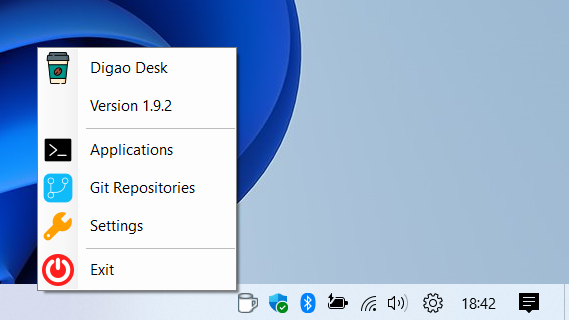

# DigaoDesk
Desktop App to Run and Monitor Console Processes


# Purpose

When we are working with local services, especially with Microservices, we often need to run and monitor several applications together.

If we are developing applications, we will have some services running directly in the IDE. However, we don't want to run all services directly in the IDE, usually when talking about dependencies.

For these cases, I developed this tool, where you can add all local applications, allowing them to run simultaneously and monitor the output of each one.

You will be able to configure backend and frontend applications.

# Press play and go get a coffee

The idea of ​​this software is to allow applications to run in the background, without disturbing the focus on the main work, for example, using the development IDE.

Thus, the application is running in the Windows tray, allowing monitoring at any time, and displaying activity alerts.



# Git Repositories


There is another function available in tray menu, allowing you to manage your git repositories. Just configure a git repositories folder and all git repos will appear in the form grid. You can use basic git commands like:

- New Branch (create a new branch from current branch or from a specific tag)
- Delete Branch (delete a branch locally and/or remotely)
- Checkout (checkout a remote branch)
- Switch (checkout a local branch)
- Fetch
- Pull
- Commit (manage staging area, show diffs in external tool, undo changes)
- Cherry Pick
- Merge
- Sync (merge from master branch)
- Cancel Operation (cancel current git operation)
- Push
- Open Shell program

# Settings

You can set usage preferences as needed.


# Limitations

## Git integration

The git integration works only with HTTP / HTTPS remote origin in repositories. So, if you have repositories configured by SSH remote origin, you must change origin url to compatible one.

Here you can get an example how to change you repository from SSH to HTTPS url:

```
git remote set-url origin https://username@domain.com/cluster/my-repository.git
```

## Applications Log Lines

The log of application is limited by 1,000,000 characters due to increase log loading speed.

