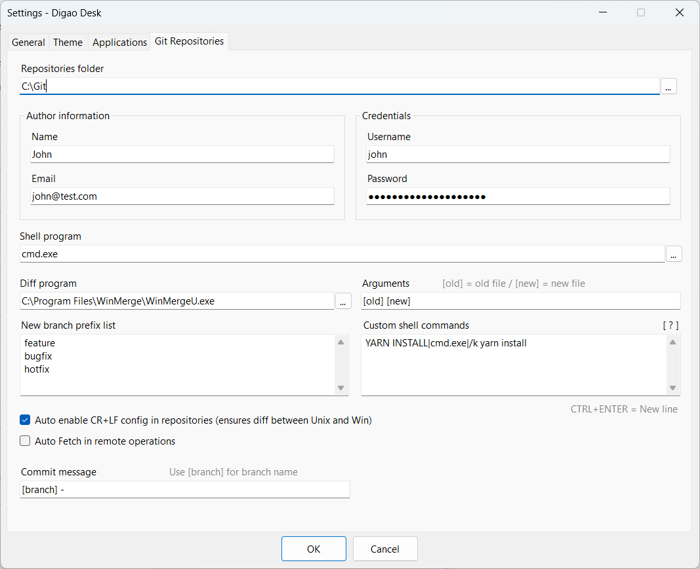

:newspaper: [Digao Dalpiaz News on Telegram](https://t.me/digaodalpiaznews)

# DigaoDesk
Windows App to Run and Monitor Console Processes

# Purpose

When we are working with local services, especially with Micro-services, we often need to run and monitor several applications together.

If we are developing applications, we will have some services running directly in the IDE. However, we don't want to run all services directly in the IDE, usually when talking about dependencies.

For these cases, I developed this tool, where you can add all local applications, allowing them to run simultaneously and monitor the output of each one.

You will be able to configure back-end and front-end applications.

# Press play and go get a coffee

The idea of ​​this software is to allow applications to run in the background, without disturbing the focus on the main work, for example, using the development IDE.

Thus, the application is running in the Windows tray, allowing monitoring at any time, and displaying activity alerts.

# Git Repositories

There is another function available in tray menu, allowing you to manage your git repositories. Just configure a git repositories folder and all git repos will appear in the form grid. You can use basic git commands like:

- New Branch (create a new branch from current branch or from a specific tag)
- Delete Branch (delete a branch locally and/or remotely)
- Checkout (checkout a remote branch)
- Switch (checkout a local branch)
- Fetch
- Pull
- Commit (manage staging area, show diffs in external tool, undo changes)
- Cherry Pick
- Merge
- Sync (merge from master branch)
- Cancel Operation (cancel current git operation)
- Push
- Open Shell program
- Run custom command in repository folder

# Installation

1. Download and install [.NET 8 Desktop Runtime x64](https://dotnet.microsoft.com/en-us/download/dotnet/8.0)

2. Download last Digao Desk release (.exe) from [here](https://github.com/digao-dalpiaz/DigaoDesk/releases/latest)

3. Create a folder in your computer, put the downloaded .exe in the folder and create a shortcut in your desktop.

You are set. Enjoy!

# Languages

The app supports following languages:

- English
- Chinese (Thanks to @wcxu21)
- Portuguese Brazil

Feel free to help me translating the app to your language. :)

# Running Backend and Frontend applications

## Backend Java Applications

### Spring-boot

- Command line: `mvn.cmd`
- Arguments: `spring-boot:run`
- Working directory: Your app directory

### Quarkus

- Command line: `mvn.cmd`
- Arguments: `quarkus:dev`
- Working directory: Your app directory

## Frontend Applications

### NPM

- Command line: `npm.cmd`
- Arguments: `start`
- Working directory: Your app directory

### Yarn

- Command line: `yarn.cmd`
- Arguments: `start`
- Working directory: Your app directory

> Important! Ensure the command file is included in PATH environment variable (or include full path in command line). If you change environment variables, please close and reopen Digao Desk to reload the variables.

# Running Windows Script files

## Running Batch files (.cmd)

Just set ".cmd" file in application Command Line field.

## Running PowerShell files (.ps1)

Just set ".ps1" file in application Command Line field.

# Settings

You can set usage preferences as needed, like Language, Theme, and Git Credentials and much more.

## Bitbucket Authentication

To use repositories with Bitbucket authentication, simply create an App Password in managing your Bitbucket account.

When creating an App Password, you will receive an authentication hash. So, just configure the Digao Desk as follows:

- Login = Bitbucket username
- Password = Bitbucket App Password hash

## GitHub Authentication

To use repositories with GitHub authentication, simply create a Personal Access Token in GitHub Developer Settings.

When creating a Personal Access Token, you will receive an authentication hash. So, just configure the Digao Desk as follows:

- Login = GitHub account email
- Password = GitHub personal access token hash

## Azure Authentication

To use repositories with Azure authentication, simply create a Personal Access Token in Azure User Settings.

When creating a Personal Access Token, you will receive an authentication hash. So, just configure the Digao Desk as follows:

- Login = Azure username
- Password = Azure personal access token hash

# Requirements

This app needs .NET 8 Desktop Runtime x64.

# Applications Definitions

When you are using Digao Desk in a company environment, you may have a lot of develepers using the same applications in their environment.

Each developer needs to include applications definitions in his environment. This action may take a lot of time and can result in different applications behaviors.

To solve that, you can share a package of your company applications settings. Then, developers are able to download this package directly in Digao Desk environment.

## How to create a package

1. Create a zip file containing a copy of "applications.json" file. You can get this file in the same folder where DigaoDesk.exe is. Just configure the applications directly in Digao Desk as desired and then get the file.

2. Upload the zip file in a host.

3. Provide the URL to users so they can download the definitions!

> When a user downloads the definitions, the applications will be inserted or updated in applications list, according to the **name** of application.

> You can include other files in zip package. All files will be extracted in `%PROGRAMDATA%\DigaoDesk` folder.

> The fields `Command line`, `Arguments` and `Working directory` of an application supports Windows folders variables, like `%PROGRAMDATA%`.
